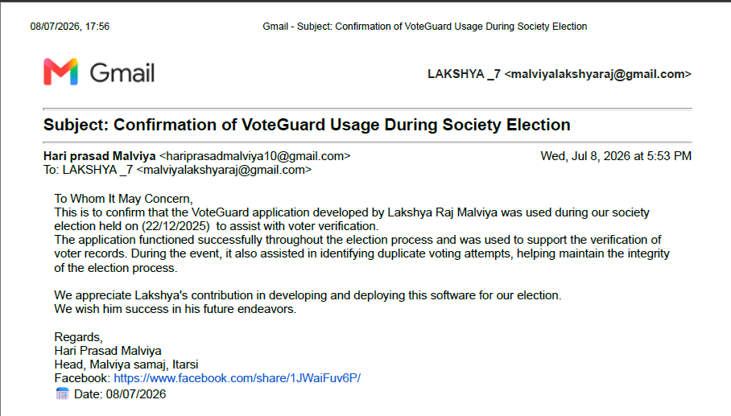
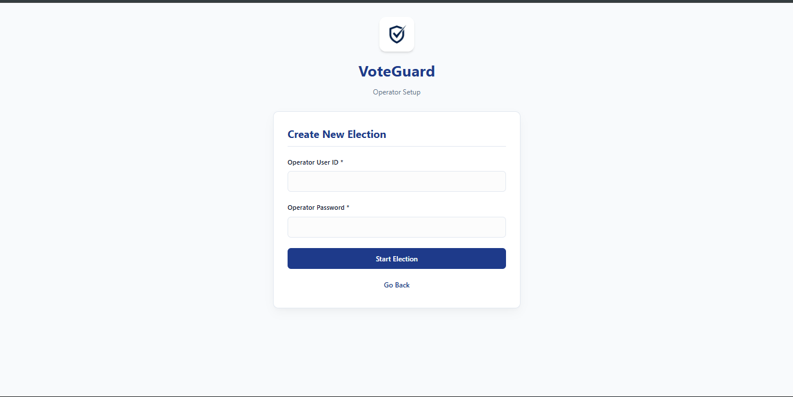
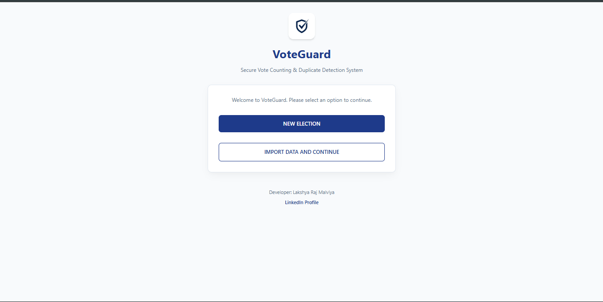
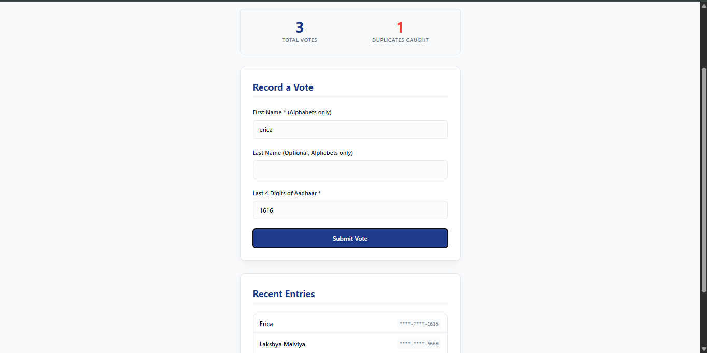
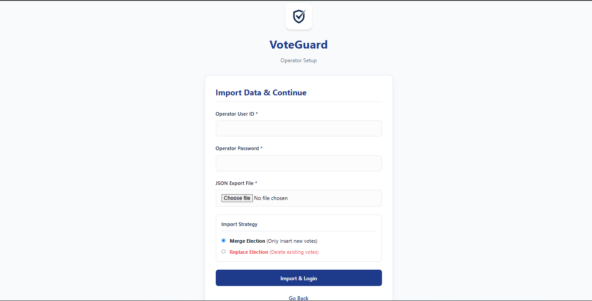

<div align="center">
  
  <h1>VoteGuard</h1>
  <p><strong>Secure Vote Verification Platform</strong></p>

---

## 📌 Overview

**VoteGuard** is a secure, lightweight full-stack web application designed for verifying and storing voting records.

Elections, particularly at the local or community level, often suffer from logistical challenges regarding data integrity and the prevention of multiple voting attempts. VoteGuard solves this by acting as a strict verification layer. By processing user identities through composite keys (combining a voter's First Name and the last 4 digits of their Aadhaar card), the application instantly detects and blocks duplicate voting attempts, ensuring a fair and transparent democratic process.

## 🏆 Real-World Deployment

VoteGuard is not just a theoretical project—it is production-tested.

The software was successfully deployed during a **live local community election**. During its operation, the system effectively processed voter entries and successfully identified and prevented several duplicate voting attempts, directly safeguarding the integrity of the election results.


*Email verification of the system's deployment in a live community election.*

## ✨ Features

- **Operator Authentication**: Secure login portal to ensure only authorized personnel can enter data.
- **Duplicate Vote Prevention**: Strict database-level constraints that block repeated entries using composite identities.
- **SQLite Persistence**: Reliable on-disk data storage.
- **JSON Export & Import**: Robust data backup and restoration pipelines (supports merging or completely replacing election states).
- **Real-Time Stats**: Live dashboard tracking total verified votes and caught duplicates.
- **Modern Responsive UI**: A mobile-first, glassmorphism light/dark theme providing an excellent user experience for operators on any device.
- **Lightweight Full-Stack Architecture**: Zero-bloat design utilizing Flask and Vanilla JS.

## 📸 Screenshots

- **Login / Operator Access***Secure operator authentication interface.*
- **Main Dashboard & Vote Entry***The primary dashboard for entering voter data and monitoring live statistics.*
- **Duplicate Vote Error***The system immediately rejecting a duplicate voting attempt.*
- **Data Management (Import/Export)**
  
  *JSON-based pipeline for securely backing up or restoring election sessions.*

## ⚙️ Engineering Highlights

- **Database-Level Duplicate Detection**: Shifted validation from Python logic strictly into the SQLite schema using `UNIQUE(election_id, first_name, aadhaar_4)`. This guarantees data integrity even if race conditions occur.
- **CSRF Protection**: All form submissions and asynchronous Fetch API requests are heavily secured using `Flask-WTF` CSRF tokens.
- **Case-Insensitive Validation**: Data sanitization occurs prior to database insertion, ensuring "John" and "john" are recognized as the exact same identity.
- **JSON Pipeline**: Custom serialization and deserialization allowing entire database states to be packaged securely into JSON.
- **Application Context DB Management**: Utilizes Flask's application context (`g.db`) to ensure efficient database connection pooling and automatic cleanup post-request.

## 🏗 Architecture / Workflow

VoteGuard operates on a robust 3-tier architecture:

1. **Authentication:** The operator inputs credentials which are securely validated using hashed passwords (`werkzeug.security`).
2. **Data Entry:** Operator enters voter details in the SPA dashboard.
3. **Validation & Storage:**
   - The Vanilla JS frontend sends a POST request to the Flask backend.
   - Flask sanitizes the input and attempts to commit it to SQLite.
   - SQLite evaluates the composite key constraint. If valid, the vote is saved. If it violates uniqueness, an `IntegrityError` is thrown, caught by Flask, and passed to the frontend to flag the duplicate.
4. **Live Updates:** The DOM updates dynamically to reflect successful votes or increment the caught duplicate counter.

## 📁 Folder Structure

```text
Voteing-verification/
├── app.py                # Core Flask backend and routing
├── migration.py          # SQLite schema migration script
├── requirements.txt      # Python dependencies
├── README.md             # Project documentation
├── static/
│   ├── logo.png          # VoteGuard logo
│   └── style.css         # UI styling (Mobile-responsive, glassmorphism)
└── templates/
    ├── landing.html      # Gateway screen
    ├── auth.html         # Login / Setup / Import screen
    ├── dashboard.html    # Main voting interface
    ├── 404.html          # Custom Not Found error
    └── 500.html          # Custom Server Error
```

## 🔐 Demo Credentials

If you are accessing the live demo, you can test the application using the following operator credentials:

- **Username:** `admin`
- **Password:** `admin123`

## 🚀 Setup & Run Locally

### Prerequisites

- Python 3.8+
- pip (Python package installer)

### Installation

1. **Clone the repository**

   ```bash
   git clone [ADD GITHUB LINK HERE]
   cd Voteing-verification
   ```
2. **Install dependencies**

   ```bash
   pip install -r requirements.txt
   ```
3. **Run the application**

   ```bash
   python app.py
   ```
4. **Access the platform**
   Open your browser and navigate to: `http://127.0.0.1:5000`

## 🔮 Future Improvements

While highly effective for its current scope, future iterations of VoteGuard could benefit from:

- **JWT Authentication:** Transitioning from session-based auth for better stateless scaling.
- **Role-Based Access Control (RBAC):** Separating permissions between standard data-entry operators and system administrators.
- **Audit Logs:** Immutable tracking of exactly which operator recorded or deleted specific entries.
- **Cloud Database Migration:** Moving from SQLite to PostgreSQL for high-concurrency enterprise deployments.
- **OTP Verification:** Adding SMS or Email OTPs for voters to confirm their identity directly.

## ⚠️ Disclaimer

This project was built for localized, small-scale community verification use. While it implements standard web security practices (CSRF, Password Hashing, DB constraints), deploying this for large-scale or high-stakes government elections would require significantly stronger infrastructure, compliance audits, and advanced cryptographic security protocols.

## 👨‍💻 Author

**Lakshya Raj Malviya**

- **LinkedIn:** [https://www.linkedin.com/in/lakshya-raj-malviya/](https://www.linkedin.com/in/lakshya-raj-malviya/)
- **GitHub:** [[ADD GITHUB PROFILE LINK HERE]]
- **Email:** [[ADD EMAIL HERE]]
